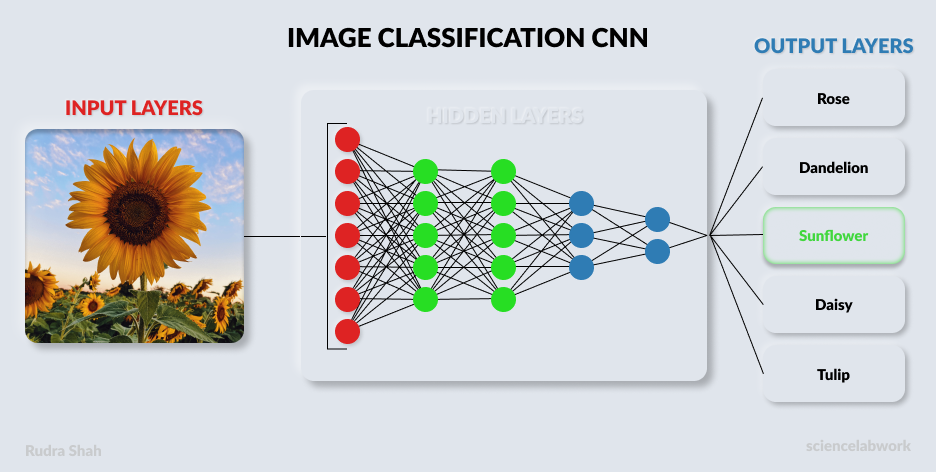

#  &nbsp;Flowers Classification with CNN



## What is CNN?

CNN is a powerful model for image classification. It is a convolutional neural network (CNN) that is trained to classify images into a small set of categories, such as faces, dogs, cats, and so on.

## Understanding Model

To see the example of CNN we are going to make a Image Classification with CNN on Flowers Dataset. This dataset is available on Kaggle or google api. The flower data set contains 5 classes of Image. The classes are:

| Flowers | Images |
|:-------:|:------:|
| Roses | 641 |
| Dandelion | 898 |
| Tulips | 799 |
| Sunflowers | 699 |
| Daisy | 633 |

To divide our dataset into training and test set we are going to use basic Python function to divide it in two folders.

| Train | Test |
|:----:|:----:|
| 2935 | 735 |

Our model contains several layes with convolutional, max pooling, and dense layers. We are going to use some activations like relu and softmax. where relu is the rectified linear unit and softmax is probability distribution. To avoid overfitting we are going to use dropout.

## Model Summary
```
Model: "sequential"
_________________________________________________________________
 Layer (type)                Output Shape              Param #   
=================================================================
 conv2d (Conv2D)             (None, 148, 148, 32)      896       
                                                                 
 max_pooling2d (MaxPooling2D  (None, 74, 74, 32)       0         
 )                                                               
                                                                 
 conv2d_1 (Conv2D)           (None, 72, 72, 64)        18496     
                                                                 
 max_pooling2d_1 (MaxPooling  (None, 36, 36, 64)       0         
 2D)                                                             
                                                                 
 conv2d_2 (Conv2D)           (None, 34, 34, 128)       73856     
                                                                 
 max_pooling2d_2 (MaxPooling  (None, 17, 17, 128)      0         
 2D)                                                             
                                                                 
 conv2d_3 (Conv2D)           (None, 15, 15, 128)       147584    
                                                                 
 max_pooling2d_3 (MaxPooling  (None, 7, 7, 128)        0         
 2D)                                                             
                                                                 
 dropout (Dropout)           (None, 7, 7, 128)         0         
                                                                 
 flatten (Flatten)           (None, 6272)              0         
                                                                 
 dense (Dense)               (None, 512)               3211776   
                                                                 
 dense_1 (Dense)             (None, 5)                 2565      
                                                                 
=================================================================
Total params: 3,455,173
Trainable params: 3,455,173
Non-trainable params: 0
_________________________________________________________________
```

## Website To visit

* [sciencelabwork](http://www.sciencelabwork.cf) <br>
* [rudraspot](http://rudraspot.me)

## Contact Me

* [Instagram](https://www.instagram.com/rudra_shah_) <br>
* [Twitter](https://www.twitter.com/labworkscience)

## Contributing

I welcome contributions. If you have any questions or suggestions, please open an issue, create a pull request or you can use above contact information.

> **Sample flowers for testing are picked up from Google, So I don't take any legal right over it.**